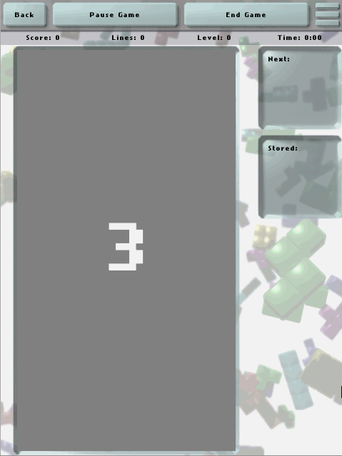
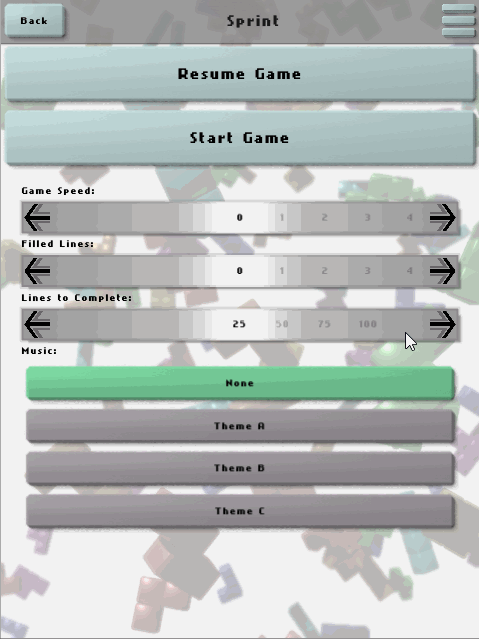
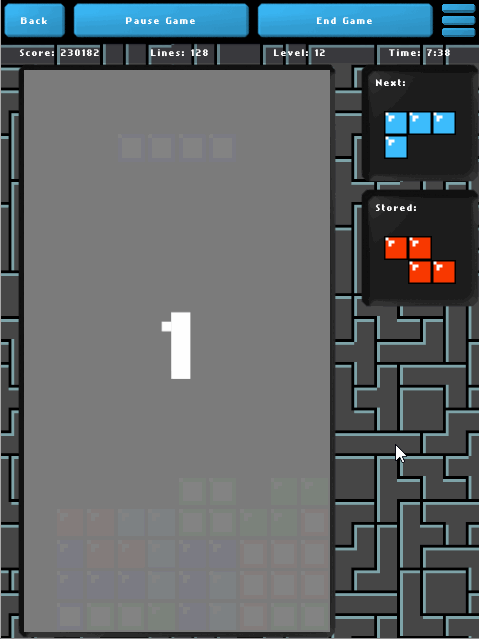

# Tetrivium

Tetrivium is a game inspired by a specific falling-block puzzle game developed by a talented Russian programmer in the 80s.

Programmed in Python, built on the Kivy framework.

Uses the UPnPy for port forwarding as a fallback method if it is available and necessary.

#### Features:
* Cross-platform - will run on anything that Kivy runs on: Windows/Linux/Mac/Android/IOS/etc.
* Clean graphics, animations and interface designed to work on a wide variety of devices and screens.
* Support for a variety of input methods including gamepads and advanced touchscreen buttons or gestures.
* Resume your game even if the app is closed and restarted.
* Save your high scores as well as full game replays to watch again later.
* Multiplayer support through multiple devices, including cross-platform play.
* Full theme support - make the game look as retro or modern as you want.
* Use your own music - just load a music folder as a theme.

An alternate 'Retro' theme with 8bit inspired graphics, sound effects and music remixes is included, check the 'themes/Retro' folder for it.

Please be warned that multiplayer may still be buggy, and may not work at all depending on your network setup.
